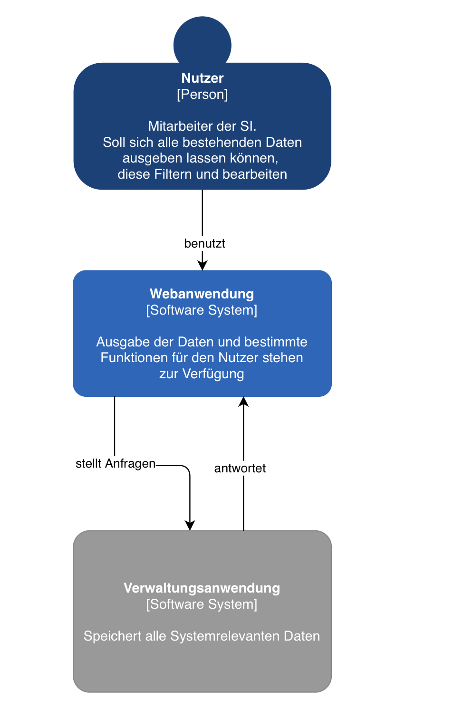

= Architecture Notebook: {project-name}
// Vorname Nachname <email@domain.org>; Vorname2 Nachname2 <email2@domain.org>; Vorname3 Nachname3 <email3@domain.org>
// {localdatetime}
// include::../_includes/default-attributes.inc.adoc[]
// Platzhalter für weitere Dokumenten-Attribute

== Zweck

Dieses Dokument beschreibt die Philosophie, Entscheidungen, Nebenbedingungen, Begründungen, wesentliche Elemente und andere Aspekte des Systems, die Einfluss auf den Entwurf und die Implementierung haben.

//Hinweise: Bearbeiten Sie immer die Abschnitte 2-6 dieser Vorlage. Nachfolgende Abschnitte sind empfohlen, aber optional und sollten je nach Umfang der künftigen Wartungsarbeiten, Fähigkeiten des Entwicklungsteams und Bedeutung anderer architektureller Belange.

//Anmerkung: Die Architektur legt wesentliche EINSCHRÄNKUNGEN für den Systementwurf fest und ist ein Schlüssel für die Erfüllung nicht-funktionaler Eigenschaften!

== Architekturziele und Philosophie

//Hinweise: Beschreiben Sie die Philosophie der Architektur, d.h. den zentralen Ansatz für ihre Architektur. 

Der Zweck des Systems ist das Bereitstellen einer Webanwendung zum Verwalten von Hochschulpartnerschaften und dem Austausch von Studierenden. 
Benutzer sollten die Anwendung auf Rechnern jeglicher Art (Laptop, Notebook, Desktop-Rechner), außer mobile Endgeräte (Smartphones), im Browser benutzen können.

Die unabdingbare Erreichbarkeit des Systems ist an die Arbeitszeiten der Stabsstelle Internationales gebunden, welche sich auf 8 Stunden, 7-15 Uhr, werktags beschränkt. Außerhalb dieser Zeit besteht keine Verpflichtung für die Erreichbarkeit.

// Identifizieren Sie alle Aspekte, die die Philosophie beeinflussen, z.B. komplexe Auslieferung Aspekte, Anpassung von Altsystemen oder besondere Geschwindigkeitsanforderungen. Muss es besonders robust sein, um eine langfristige Wartung und Pflege zu ermöglichen?
Als Datenbank wird eine bereits bestehende MariaDB genutzt, die vom Rechnerzentrum bereit gestellt wird.

//Formulieren Sie eine Reihe von Zielen, die die Architektur in ihrer Struktur und ihrem Verhalten erfüllen muss. 

// Identifizieren Sie kritische Fragen, die von der Architektur adressiert werden müssen, z.B. besondere Hardware-Abhängigkeiten, die vom Rest des Systems isoliert werden sollten oder Sicherstellung der Funktionsfähigkeit unter besonderen Bedingungen (z.B. Offline-Nutzung). Daraus resultierenen Vorschriften bezüglich der Performance. 

Da der Datenbestand mit der Zeit kontinuierlich wächst und die Daten in der Regel nicht gelöscht werden sollen, liegt der Schwerpunkt auf langer Wartbarkeit und Verwendung. Diese Aspekte werden unter anderem mit der Datenbank realisiert.

Das Backend stellt Abfragen an die Datenbank, um Statistiken über die Auslandsaktivitäten zu erstellen, die dann vom Verwaltungsfrontend angezeigt werden.

Zur Unterstützung einer effizienten Bedienbarkeit wurde sich beim Design des Interfaces stark an einem bereits vorhandendem Prototyp und dem Arbeitsablauf der SI orientiert. Intuitives Arbeiten wird so ermöglicht. 

== Annahmen und Abhängigkeiten

//[List the assumptions and dependencies that drive architectural decisions. This could include sensitive or critical areas, dependencies on legacy interfaces, the skill and experience of the team, the availability of important resources, and so forth]

=== Annahmen

. Nutzer sind Mitarbeiter der Stabsstelle Internationales
. Nutzer befinden sich, mit einer stabilen Internetverbindung und einem modernen Browser, im Netz der HTW
. Jeder Nutzer erlaubt das Ausführen von Javascript-Skripten innerhalb seines Browsers

=== Abhängigkeiten 

. Abhängigkeit vom Rechenzentrum der HTW
.. Unser Server läuft über eine, vom Rechenzentrum bereitgestellte, virtuelle Maschine und muss wochentags von 7-15 Uhr erreichbar sein
.. Die Administration unserer Datenbank erfolgt über das Rechenzentrum, somit muss ein verantwortlicher Mitarbeiter die Verwaltung der Logins übernehmen
. Abhängigkeit von Vorkenntnissen der Teammitglieder
.. Ein Teammitglied hat Vorkenntnisse in der Webentwicklung mittles Python und JavaScript (jQuery)
.. Ein Teammitglied hat Vorkenntnisse in der Webentwicklung mittles HTML, CSS (Bootstrap)
. Abhängigkeit von Funktionsfähigkeit und Pflege der eingesetzten Frameworks und externen Komponenten
.. Die genutzten Frameworks (Flask, jQuery) müssen von Hersteller regelmäßig gepflegt werden.

== Architektur-relevante Anforderungen

//Fügen Sie eine Referenz / Link zu den Anforderungen ein, die implementiert werden müssen, um die Architektur zu erzeugen.
* SWFA-1 bis SWFA-3
* NFAU-1
* NFAU-2
* NFAR-1 bis NAFAR-3
* NFAP-1
* NFAP-2
* Erweiterbarkeit der Systemfunktionalität

== Entscheidungen, Nebenbedingungen und Begründungen

//[List the decisions that have been made regarding architectural approaches and the constraints being placed on the way that the developers build the system. These will serve as guidelines for defining architecturally significant parts of the system. Justify each decision or constraint so that developers understand the importance of building the system according to the context created by those decisions and constraints. This may include a list of DOs and DON’Ts to guide the developers in building the system.]

* Nutzung einer Schichtenarchitektur um eine einfache Trennung zwischen Datenverarbeitung, -darstellung und -speicherung zu erhalten

=== Webtechnologien

Durch das Verwenden der aufgeführten Webtechnologien, möchten wir eine Nutzung ohne Installation bestimmter Tools auf etablierten Browsern ermöglichen. Des Weiteren soll es späteren Arbeitsgruppen möglich sein, das bestehende System problemlos weiterzuentwickeln.

* Erstellung des Verwaltungsfrontends mit HTML / CSS / JavaScript
** Weitverbreitete, allgegenwärtige Technologien zur Webentwicklung
** Vorkenntnisse innerhalb der Gruppe
** Standard bei Webanwendungen
** Leichte Erlernbarkeit und Modularität
** Kein Technologierisiko → wird voraussichtlich lange ein Standard bleiben

=== Serverseitige Programmierung mit Python

Es wurde sich in diesem Fall für Python entschieden, da durch das Framework 'Flask' die Serverseitige Programmierung sehr übersichtlich gehalten wird. Es ist sehr einfach möglich, die aufrufbaren Seiten innerhalb des Systems zu erweitern. Des Weiteren bestand in Bezug auf Flask innerhalb des Teams vereinzelt Vorerfahrung.

* Erstellung des Backends mit serverseitiger Skriptsprache Python
** Python-Skripte laufen auf dem bereitgestellten Webspace
** Einbindung der Datenbank einfach möglich durch mysql.connector
** Vorkenntnisse in der Gruppe vorhanden

=== Datenbank MariaDB 
** Einfache Bereitstellung durch das Rechenzentrum der HTW Dresden
** Guter Zugriffsschutz und Backups auf deren Servern
** MySQL ähnlich zu MS SQL, mit dem einige Gruppenmitglieder schon Erfahrung haben
** Administration mithilfe von phpMyAdmin
*** Erstellung von Datenbankobjekten
*** Ändern von Datensätzen außerhalb des Verwaltungsfrontends
// ** Das bestehende Informationsfrontend für die Studierenden läuft ebenfalls auf einer MariaDB Datenbank → einfache Migration

=== Frameworks

Das Verwenden von Frameworks ist gerade in Gruppen mit wenig Vorerfahrung sehr von Vorteil. Der Code bleibt übersichtlich und die Webentwicklung wird erheblich vereinfacht.

. jQuery (Javascript)
. Flask (Python)

== Architekturmechanismen

https://www2.htw-dresden.de/~anke/openup/core.tech.common.extend_supp/guidances/concepts/arch_mechanism_2932DFB6.html[Doku "Concept: Architectural Mechanism"]
//[List the architectural mechanisms and describe the current state of each one. Initially, each mechanism may be only name and a brief description. They will evolve until the mechanism is a collaboration or pattern that can be directly applied to some aspect of the design.]

//Beispiele: relationales DBMS, Messaging-Dienste, Transaktionsserver, Webserver, Publish-Subscribe Mechanismus

//Beschreiben Sie den Zweck, Eigenschaften und Funktion der Architekturmechanismen.

=== Sicherheit

Durch den Bereich der Analyse und die Betrachtung des bereits vorhandenen Prototyps haben wir die Entscheidung getroffen die komplette Anwendung, durch die einzige Möglichkeit der Erreichbarkeit innerhalb des HTW Netzes, zu schützen.
Des Weiteren darf es nur Mitarbeitern der Stabsstelle Internationales möglich sein, sich im Verwaltungsfrontend anzumelden (SWFA-2).
Derzeit wird noch die Logik der Vorgruppe verfolgt den Zugriffschutz über einen Datenbankaccount zu ermöglichen.
Durch die Anforderung SWFA-3 reicht es jedoch nicht, jedem Mitarbeiter mit demselben Account Zugriff zu gewähren.
Es wird eine Serverseitige Unterscheidung zwischen den Mitarbeitern benötigt.

=== Persistente Daten

Die Anforderung (SWFA-1) machte uns darauf aufmerksam, dass unsere Daten persistent zu speichern sind. 
Uns blieb, aufgrund einiger Vorgaben, nichts anderes übrig als das bestehende Datenbankmodell zu übernehmen. 
Die Entscheidung wurde von Vorgängern getroffen, somit verwenden wir eine MariaDB welche vom Rechenzentrum gehostet wird.

=== Interface

Während der Analyse wurde mit NFAU-1, NFAU-2 festgehlaten, dass die unterschiedliche Darstellung der Webseite je nach Nutzer, ein wesentlicher Bestandteil des Projektes ist.
Durch diesen Punkt sind wir auch zu dem Entschluss gekommen, unser Frontend nach dem Schema des responsive Webdesign zu entwerfen.
Der Fakt, dass es unterschiedliche Nutzer gibt, brachte die Analyse zu der Erkenntnis, dass die Endgeräte der jeweiligen Nutzer nicht den gleichen Voraussetzungen besitzen.
Unsere Webanwendung soll später in der Lage sein, sich den jeweiligen Endgeräten der Nutzer anzupassen.

=== Datenbankkommunikation
// TODO

== Wesentliche Abstraktionen

//[List and briefly describe the key abstractions of the system. This should be a relatively short list of the critical concepts that define the system. The key abstractions will usually translate to the initial analysis classes and important patterns.]

* Fakultät: enthält Fakultätsinformationen

* Studiengang: enthält Studiengang und 1:n Beziehungen zu einer Fakultät

* Hochschule: enthält Kontaktinformationen der Hochschule und ggf einen Erasmuscode

* Ausländische Hochschule: enthält Kontaktinformationen der Hochschule 

* Mentor: enthält Kontaktinformationen der betreuenden Person des Austauschprogramms

* Hochschulvereinbarung: enthält die Art der Vereinbarung, Länge, Anzahl der Incomings/Outgoings pro Studienfach und deren maximale Aufenthaltszeit

== Schichten oder Architektur-Framework

//[Describe the architectural pattern that you will use or how the architecture will be consistent and uniform. This could be a simple reference to an existing or well-known architectural pattern, such as the Layer framework, a reference to a high-level model of the framework, or a description of how the major system components should be put together.]
=== Schichtenarchitektur

Dadurch ist es möglich dem Softwaresystem und den dazugehörigen Bestandteilen feste Aufgabenbereiche zuzuordnen.
Das System wird in logische Schichten aufgeteilt.
Diese sind die Datenbank, das Backend und das Frontend.
Die Datenbank wird den Aspekt des speicherns, bereitstellen und ändern der Daten übernehmen.
Das Frontend wird die Schnittstelle zwischen User und Systemlogik sein, welche sich im Backend befindet.
Dort werden Nutzeranfragen verarbeitet, also die Kommunikation mit der Datenbank vorgenommen.
Dem Frontend werden aber auch, abhängig der Anfrage, die richtigen Dateien zum Abbilden der HTML-Seiten bereitgestellt.

== Architektursichten (Views)

//[Describe the architectural views that you will use to describe the software architecture. This illustrates the different perspectives that you will make available to review and to document architectural decisions.]
Folgende Sichten auf die Architektur werden empfohlen:

=== Logische Sicht

//Beschreibt die Struktur und das Verhalten Systemteilen, die hohen Einfluss auf die Architektur haben. Dies kann die Paketstruktur, kritische Schnittstellen, wichtige Klassen und Subsysteme sowie die Beziehungen zwischen diesen Elementen enthalten. Zudem sollten die physische und logische Sicht persistenter Daten beschrieben werden, wenn es diesen Aspekt im System gibt. Dies ist ein hier dokumentierter Teilaspekt des Entwurfs
Das Bild beschreibt unseren bisherigen Stand der logischen Sicht auf unser System.

=== Physische Sicht (Betriebssicht)

//Beschreibt die physischen Knoten (Rechner) des Systems, der Prozesse, Threads und Komponenten, die in diesen Knoten ausgeführt werden. Diese Sicht wird nicht benötigt, wenn das System in einem einzelnen Prozess oder Thread ausgeführt wird.
Das Verwaltungsfrontend wird im Browser des Nutzers ausgeführt.
Das Backend wird auf dem www2-Server des Rechenzentrums bereitgestellt.
Die Datenbank läuft auf einem MariaDB-Server des Rechenzentrums.

=== Use Cases

//Eine Liste oder ein Diagramm der Use Cases, die architektur-relevante Anforderungen enthalten.
Architektur relvante Use Cases sind:

* UC01

* UC12
